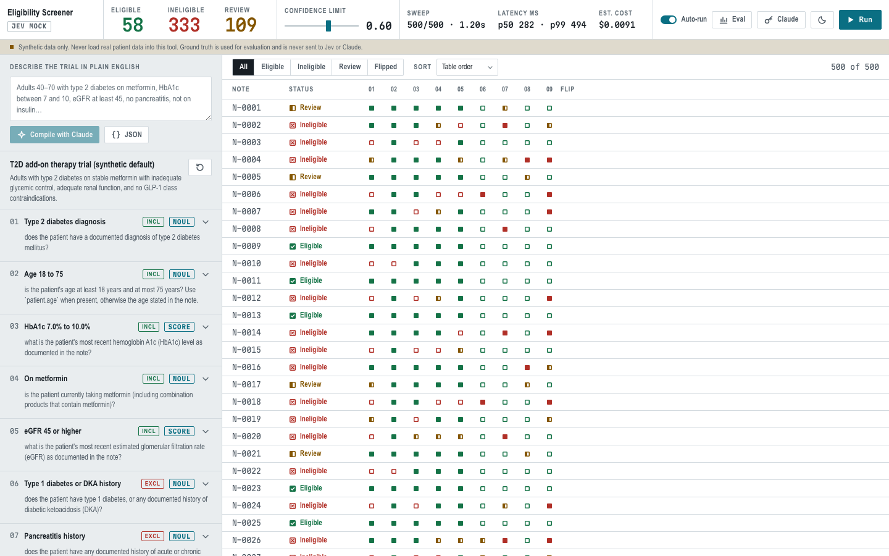
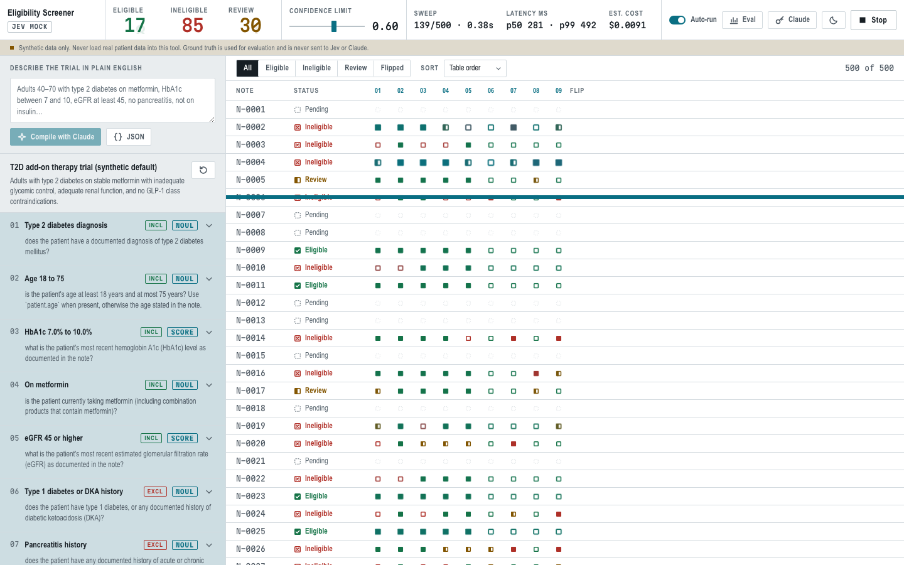
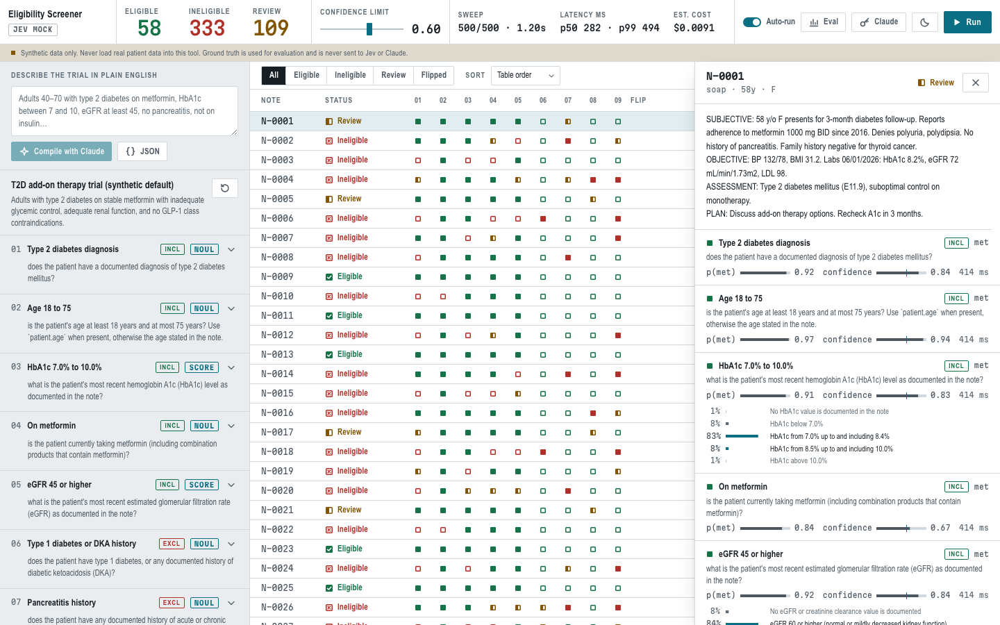
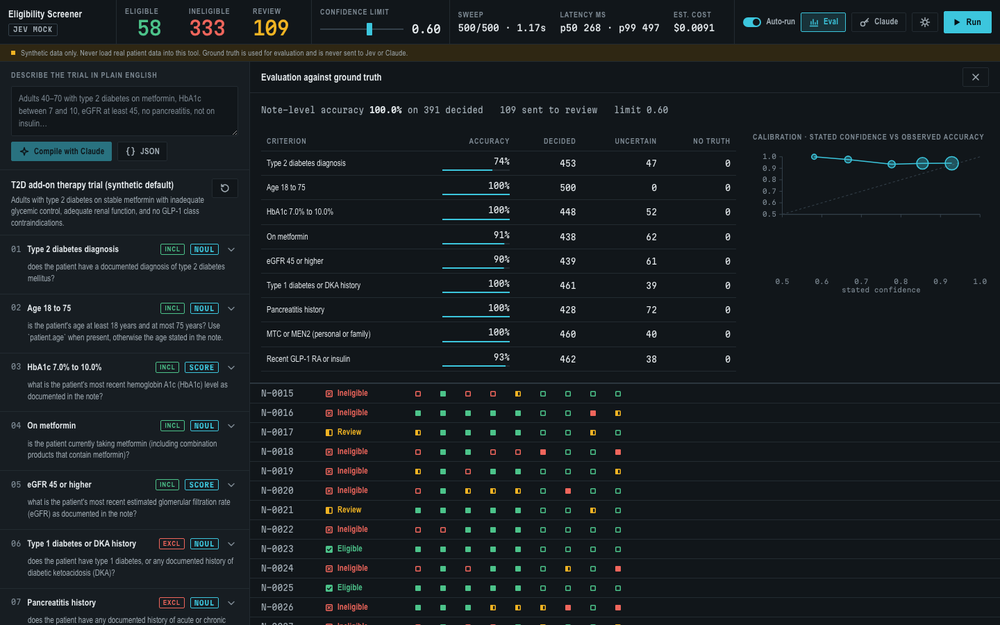
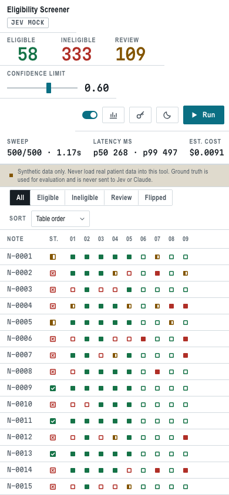

# Clinical Trial Eligibility Screener

A local web app that screens ~500 clinical notes against a trial's eligibility
criteria using [TypeSafe's Jev](https://docs.typesafe.ai) model, one
`systemOne` call per note, streaming results into a table as they land. The
demo is about speed: a full screen should finish in about a second, and you
watch it happen.

> **Synthetic data only.** This tool is a demonstration. Never load real
> patient data into it. The `truth` object that ships with each synthetic note
> is used only by the evaluation panel and is never sent to Jev or Claude.



## What it does

- **Left pane:** the trial protocol as a list of criteria. Every field is
  editable in place (Enter or click away commits). Each criterion is either a
  **Noul** (yes/no probability) or a **Score** (graded levels), and is marked
  inclusion or exclusion.
- **Right pane:** one row per note. A status field (Eligible / Ineligible /
  Review) and one lamp per criterion: filled = condition holds, hollow = absent,
  half = uncertain, dashed = pending. Color adds the trial reading (green
  favorable, red unfavorable, amber uncertain); the shape carries it alone.
- **Run** (or edit a criterion) and Jev evaluates every note. Results stream
  over Server-Sent Events in arrival order; each landing lamp blips once.
- **Confidence limit** slider re-rolls every status instantly from cached
  probabilities, with no API calls.
- **Editing a criterion** changes its hash, so only that criterion is re-asked
  across all notes; unchanged criteria come from the cache. Its column dims
  until the results refill.
- **Flipped** filter: notes whose status changed since the previous run, with
  the criterion that flipped them.
- **Eval** drawer: per-criterion accuracy against ground truth and a
  calibration plot (stated confidence vs observed accuracy).
- **Claude** as compiler: describe the trial in plain English and Claude
  produces typed criteria as JSON; after a run it can write a short summary
  from aggregate counts only. It never sees note text.

## Setup

Requirements: Node 20.6 or newer.

```bash
npm install
cp .env.example .env         # add TYPESAFE_API_KEY, or set MOCK_JEV=true
# put your notes at data/notes.jsonl (one JSON object per line, see below)
npm run import               # loads notes into SQLite (data/screener.db)
npm run dev                  # backend on :8787, UI on http://localhost:5173
```

`npm run dev` starts both processes. The backend also imports
`data/notes.jsonl` automatically on first start if the database is empty.

### Credentials

| Credential | Where it lives |
|---|---|
| `TYPESAFE_API_KEY` | `.env`, read by the backend. Never sent to the browser. |
| Anthropic API key | Entered in the web app (Claude drawer, masked input). Held in backend memory for the process lifetime. Never written to disk or logs. |

Set `MOCK_JEV=true` to use a fake Jev client that returns plausible answers
with 70–500 ms of jitter, so the UI can be tuned without quota.

### Notes file format

`data/notes.jsonl`, one object per line:

```json
{ "id": "N-0001", "text": "...", "format": "soap",
  "truth": { "age": 58, "sex": "F",
    "diagnoses": [{ "code": "E11.9", "name": "Type 2 diabetes mellitus", "onset": "2015-03-10", "active": true }],
    "meds": [{ "name": "metformin 1000 mg BID", "start": "2016-02-01", "stop": null }],
    "labs": [{ "name": "HbA1c", "value": 8.2, "unit": "%", "date": "2026-06-01" }],
    "procedures": [], "familyHistory": [] } }
```

This repository does not generate notes. A 12-note handwritten fixture lives
at `tests/fixtures/notes.sample.jsonl` for tests and local smoke runs
(`NOTES_PATH=tests/fixtures/notes.sample.jsonl npm run import`).

### Environment

| Variable | Default | Meaning |
|---|---|---|
| `TYPESAFE_API_KEY` | — | Required unless `MOCK_JEV=true` |
| `MOCK_JEV` | `false` | Use the fake client |
| `MOCK_JEV_429_RATE` | `0` | Mock only: fraction of calls that return a simulated 429 |
| `JEV_CONCURRENCY` | `50` live, `160` mock | Bounded fan-out pool size |
| `JEV_MODEL` | `jev-latest` | Model alias or pinned version |
| `PORT` | `8787` | Backend port |
| `NOTES_PATH` | `data/notes.jsonl` | Notes file for import |
| `DB_PATH` | `data/screener.db` | SQLite file |

## Scripts

| Script | What it does |
|---|---|
| `npm run dev` | Backend (tsx watch) plus Vite |
| `npm run import` | Load `data/notes.jsonl` into SQLite |
| `npm test` | Vitest: rollup logic, cache invalidation, pool, question building, eval |
| `npm run typecheck` | Server and client type checks |
| `npm run build` / `npm start` | Production build and static serving from the backend |

## Architecture

```
client/            Vite + React 19. External store with useSyncExternalStore;
                   SSE events are coalesced into one update per animation frame.
                   Rows are virtualized by hand (28px rows, overscan 8).
server/
  index.ts         Fastify routes: /api/state, /api/events (SSE), /api/run,
                   /api/criteria, /api/eval, /api/claude/*, /api/runs/:id/*
  runner.ts        Run orchestration: cache lookup, bounded pool, SSE fan-out,
                   decision log, latency percentiles, 429 back-off
  pool.ts          Concurrency pool with a shared pause gate
  db.ts            better-sqlite3 schema and queries
  jev/types.ts     JevClient interface (the seam)
  jev/real.ts      TypeSafe SDK client; reads rate-limit headers
  jev/mock.ts      Fake client with jitter, negation-aware keyword heuristics
  jev/questions.ts Criterion -> noul()/score() question; answer -> probability
  claude.ts        Compiler (structured JSON output) and aggregate summarizer
  eval.ts          Truth functions for the default protocol; accuracy and
                   calibration
  protocol.ts      Default T2D protocol, 9 criteria
shared/
  types.ts         Domain types shared by both sides
  rollup.ts        met / not met / uncertain and eligible / ineligible / review,
                   flips, weighted score. Pure; tested.
  hash.ts          Criterion hash over the question-bearing fields
```

### How a run works

1. `POST /api/run` creates a run and returns immediately.
2. For every note, the runner looks up cached answers by
   `(note id, criterion hash)`. Notes with every criterion cached are emitted
   at once. The rest go to a pool of `JEV_CONCURRENCY` workers.
3. Each worker makes **one `systemOne` call per note**: state is
   `{ note, patient: { age, sex } }` (demographics parsed from the note text
   itself, never from `truth`); questions are one per missing criterion, keyed
   by criterion id, `noul(...)` for boolean criteria and `score(...)` for
   graded ones.
4. A Noul's probability is `answers[id].noul`; its confidence is `|2p − 1|`.
   A Score's probability of "met" is the mass on the criterion's `metLevels`;
   its confidence is Jev's reported confidence.
5. Each note's result is pushed over SSE as it lands, cached, and logged to the
   `decisions` table with the exact question, probability, confidence,
   threshold, and latency. `GET /api/runs/:id/replay` rebuilds a run from that
   log with no API calls.
6. On 429 the SDK retries with back-off and honors `Retry-After`; the runner
   additionally pauses the whole pool so fifty workers do not retry at once.
   Rate-limit headers seen on responses are recorded in the run's stats.
7. When the pool drains the run records p50/p95/p99 latency, input tokens, and
   an estimated cost (`$0.042` per million input tokens, from the TypeSafe
   models page), and stores a per-note status snapshot for the Flipped filter.

### Rollup (in code, not in Jev)

For each criterion: `uncertain` if confidence is below the limit, else `met` if
`p ≥ 0.5`, else `not_met`. A note is `ineligible` if any inclusion is `not_met`
or any exclusion is `met`; otherwise `review` if anything is `uncertain`;
otherwise `eligible`. Moving the slider recomputes all of this in the browser.

### Rate limits

TypeSafe currently lists 1,200 requests per minute for Jev. A 500-note screen
issues up to 500 requests in a burst, so sustained repeated runs can hit 429.
The runner backs off and reports pauses in the header; the cache means a
re-run after an edit asks only what changed.

## Screenshots

| | |
|---|---|
|  |  |
|  |  |
|  |  |

Screenshots were taken in `MOCK_JEV=true` mode against the bundled fixture
repeated to 500 rows; the answers are heuristic, not Jev's. The mock pool
defaults to 160 so that its 70–500 ms jitter lands a 500-note sweep near one
second; the live default of 50 is sized against TypeSafe's published rate
limits, and real sweep time is a property of Jev's latency and your limit.
